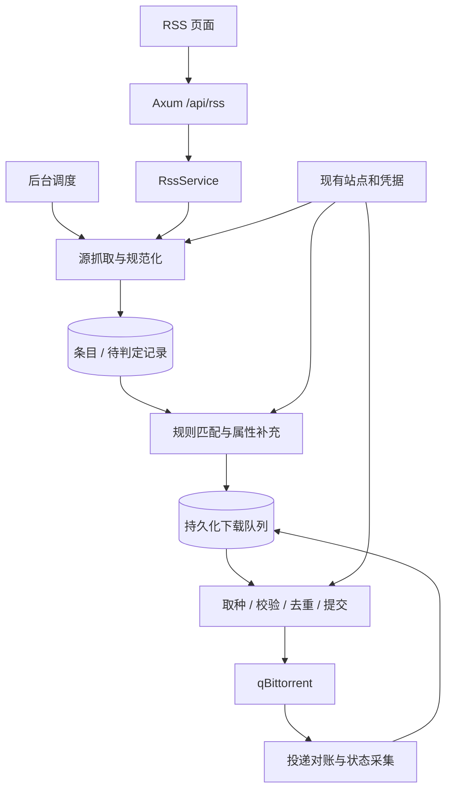
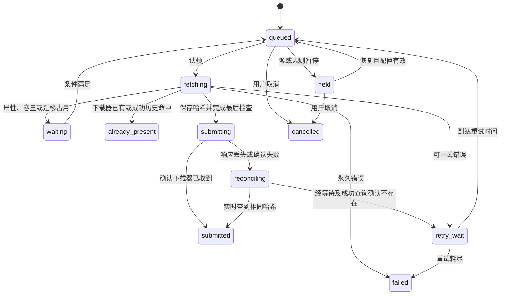

# RSS 下载器模块设计方案

状态：首版已按此方案实施，验证结果与实现调整见文末。设计依据：kirara `e6a4cff`，2026-09-08；实现验证：2026-09-09 至 2026-09-10。

本文保留完整产品、交互和技术设计，实际接口以 [OpenAPI](rss-openapi.yaml) 为准，操作步骤见 [使用说明](rss-downloader.md)。模块按云母的 PT 使用场景设计：订阅种子 RSS，匹配资源，提交到已配置的 qBittorrent。

## 1. 模块定位

新增「资源与订阅 → RSS 下载」，入口为 `#/rss`。用户粘贴 RSS 地址、选择下载规则和下载器后，系统持续检查新增条目；每条资源都能解释为什么下载、为什么跳过、失败后如何恢复。

| 模块 | 用户的目标 | 决策依据 | 下载后的职责 |
|---|---|---|---|
| 自动追剧 | 获取特定电影、电视剧及集数 | TMDB 身份、季集目标、质量方案 | 推进订阅目标，衔接已有媒体流程 |
| RSS 下载 | 收取符合条件的新种子 | RSS 条目、标题和属性规则 | 确认投递并展示下载器状态 |
| 刷流任务 | 按流量和做种策略持续选种 | 促销、活跃时间、容量和删种策略 | 持续管理做种及清理 |

RSS 下载适合发布组、纪录片、音乐、软件、学习资料等订阅，也能用于简单影视关键词订阅。它不依赖 TMDB，不承诺识别同一集的不同发布版本，不推进影视集数，不自动删种或删除文件。

首版成功标准：用户能完成「验证 RSS → 创建规则 → 预览命中 → 启用 → 查到实际投递结果」，且首次启用不批量补下源中的历史条目。

## 2. 核心决策与首版范围

采用「订阅源 + 下载规则 + 持久化下载任务」三个独立对象。同一源只抓取一次，可以供多条规则使用；一条规则可以选择多个源，指定一个目标下载器。创建界面将它们串成连续流程，避免用户理解数据库关系。

| 决策 | 建议 |
|---|---|
| 数据源格式 | 首版支持 RSS 2.0 和常见 Torznab 扩展；Atom、RSS 1.0 后续增加 |
| 下载内容 | `.torrent` 种子；普通附件、磁力链接直投后续增加 |
| 下载器 | 复用现有 qBittorrent 配置和连接池 |
| 检查频率 | 默认 15 分钟，可选 5–1440 分钟；遵守远端限速 |
| 首次处理 | 首次成功抓取建立历史基线，仅自动处理此后新发现的条目 |
| 新规则生效 | 默认只处理规则启用后新发现的条目；历史补下须显式选择 |
| 标题筛选 | 包含词、排除词、可选正则；完全无筛选须显式选择「匹配全部条目」 |
| 属性筛选 | 大小区间、最低做种数、仅免费、H&R 策略 |
| 默认属性 | 不限制大小、做种数和免费；H&R 默认「仅下载确认无 H&R 的资源」 |
| 规则冲突 | 同一条目、同一下载器按优先级只选择一条规则；不同下载器可分别投递 |
| 历史去重 | 同源身份去重、站点种子身份去重、目标下载器内 infohash 去重 |
| 突发限制 | 默认每源每个检查周期最多新增 20 个下载任务，超额保留待处理 |
| 错误恢复 | 可重试错误退避；提交结果不明先对账；凭据错误等待修复 |
| 结果显示 | 「已加入队列」「已提交」「下载中」「已完成」使用不同含义 |

首版包含源和规则的增删改、暂停恢复、手动检查、规则预览、指定历史条目补下、下载记录、重试、取消未提交任务，以及 Web / 桌面共用 API。

后续范围：Atom、磁力链接、来源导入导出、正则命名捕获与路径模板、每日配额、多个下载器负载分配、通知、影视版本升级。首版不依赖这些能力完成核心流程。

上述数量是建议的产品保护值，不是性能实测结论。实现前可调整，但不能省略基线、去重和对账语义。

## 3. 用户流程

### 3.1 第一次创建

1. 点击「添加订阅源」，填写名称、RSS 地址，选择关联站点；含独立 Passkey 的地址可以不关联站点。
2. 点击「测试并预览」。展示源标题、可解析条目数、最多 20 条样例及异常原因；测试不写历史基线、不创建下载任务。
3. 点击「保存订阅源」。源开始收集条目，第一次成功抓取建立基线。源本身没有默认的“全部下载”规则。
4. 接着点击「为此源创建规则」，填写包含词、排除词、目标下载器与可选保存目录。
5. 在规则编辑页查看预览，逐项了解匹配结果；底部显示类似「当前样例 20 条，符合 3 条。启用后仅下载新发现的内容」。这些数字来自实际预览。
6. 点击「保存并启用」。如果需要当前内容，另行选择「补下已有条目」，列出具体资源和目标后提交。

可以跳过测试保存源，或先保存停用规则。没有下载器时仍能保存源、浏览条目和预览；启用下载规则时引导完成下载器配置。

### 3.2 日常查看

进入 RSS 下载后，先看到订阅源状态与最近检查结果。点击源进入其条目列表，筛选「待处理、已入队、已跳过、需处理」，展开单条资源即可看到规则判定与下载任务。

「立即检查」会抓取并按已启用规则处理；「测试并预览」仅检查连接或规则。两者使用不同文案，避免误认为刷新没有下载副作用。

### 3.3 处理异常

错误保留在对应源或任务旁边，同时进入「需处理」筛选。例如：

- 源认证失败：「站点登录已失效」→「前往站点配置」「重新检查」。
- 规则条件无法判断：「源未提供 H&R 信息，关联站点暂不支持补充查询」→「查看规则」。
- 下载器离线：「暂时无法连接，下一次重试 14:35」→「检查下载器」。
- 提交超时：「正在确认 qBittorrent 是否已收到任务」→「立即对账」。
- 种子链接失效：「已重新抓取订阅源，仍未取得有效种子」→「重新检查来源」。

修复操作保留原配置和错误上下文，不要求用户删除源再创建。

## 4. 页面结构与交互

沿用现有云母工作台的 Operate 模式：深色侧栏、暖白内容区、朱红主操作、系统中文字体、紧凑列表和局部反馈。现有 `DESIGN.md`、Tailwind 令牌、共享表单组件是视觉依据；已有站点页截图只作为风格参考，不作为当前页面完整结构的保证。

### 4.1 主页面

主页面使用三个页签，保留页签、筛选与选中源到 hash 查询参数，支持刷新和分享定位：

| 页签 | 展示内容 | 主要操作 |
|---|---|---|
| 订阅源 | 名称、站点、启停、最近检查、下一次检查、待处理条数、异常 | 添加、检查、暂停、编辑、查看条目 |
| 下载规则 | 名称、来源范围、条件摘要、下载器、优先级、启停、近期命中 | 新建、预览、编辑、调整优先级、暂停 |
| 下载记录 | 资源、来源、命中规则、目标、投递状态、下载状态、最近错误 | 查看判定、重试、对账、取消 |

顶部只保留一行运行摘要，例如「运行中 4 · 已暂停 1 · 需处理 2」。摘要可点击筛选；不使用大面积统计卡挤压操作区。

结构示意，括号内数量仅表示布局位置：

```text
现有侧栏 │ RSS 下载                         [当前页签的主操作]
         │ 按规则收取 RSS 中的新种子
         │
         │ [订阅源]  [下载规则]  [下载记录]
         │ 运行中 (…)  已暂停 (…)  需处理 (…)
         │ [搜索名称 / 资源] [站点] [状态]
         │ ───────────────────────────────────────────
         │ 名称 / 来源    状态    最近结果    下次检查    操作
         │ …
         │
         │ 选中订阅源 → 条目列表 → 展开匹配与投递详情
```

点击源进入同一模块内的详情视图 `#/rss?tab=feeds&feed=<id>`，有明确返回入口；不在工作台侧栏之外再加一层永久侧栏。下载任务可通过 `tab=downloads&job=<id>` 定位。

### 4.2 源配置

复用共享 Dialog：名称、RSS 地址、关联站点、检查间隔；高级项仅包含代理继承方式和首次处理说明。站点 Cookie/API Key 从站点配置引用，不在此复制一套账户表单。

已保存地址展示脱敏形式，例如 `https://tracker.example/rss.php?passkey=••••`。编辑输入留空表示保留原地址；脱敏文本不能成为实际请求值。测试失败时保留输入并显示可重试原因。

### 4.3 规则编辑

规则字段较多，使用模块内编辑视图，不把长表单塞进窄弹窗。

桌面左侧为表单，右侧为预览；窄屏改为「规则配置 / 匹配预览」两个面板切换，保留草稿。配置按「来源 → 匹配条件 → 下载位置 → 执行控制」排序，高级正则和容量保护默认折叠。

预览区固定展示：样例总数、符合数、被排除数、信息不足数、每条的原因。匹配字符可以高亮，但不能只用颜色表达通过与拒绝。默认预览使用本地已抓取数据并标注时间；「重新抓取样例」才访问远端。

### 4.4 状态、可访问性与响应式

源的「启用状态」和「最近检查结果」是两个字段，允许同时显示「已暂停 · 上次检查失败」。任务的投递结果与下载器当前状态也分别展示。

首屏加载使用列表骨架；无源时说明下一步并提供添加入口；无规则时提示「已收集条目，尚未开启自动下载」；筛选无结果提供清除筛选。刷新失败保留已有数据和数据时间。

手机列表按记录堆叠，优先显示名称、状态、时间和主要操作；次要字段展开查看。复用既有移动导航与底部留白。按钮触控区域至少 44px，输入有可见标签，错误关联字段，Dialog 保留焦点管理，预览结果通过适度的 `aria-live` 通知。轮询不能覆盖编辑草稿或抢占焦点。

## 5. 规则语义

### 5.1 条件表达

规则内不同条件为 AND；包含词支持「全部满足 / 任意满足」，默认全部满足；排除词任意命中即拒绝。多个规则独立计算，不把不同规则拼成一个大 AND。

标题匹配只针对规范化标题，不默认搜索 description 中的促销文案。普通关键词按子串匹配；规范化统一 Unicode NFKC、空白和大小写，保留原始标题用于显示。Rust 是规则校验与匹配的唯一权威，前端不另用 JavaScript 正则计算结论。

正则使用 Rust `regex` 语法，保存及预览前编译校验，建议单表达式最多 512 字符；界面说明不支持回溯引用和环视。关键词单项最多 100 字符，每组最多 50 项。大小以字节保存、GiB 输入输出，区间含边界。

示例：

```text
规则：纪录片 WEB-DL
来源：已选择的两个纪录片 RSS
包含词（全部）：Documentary、1080p
排除词（任意）：CAMRip、HDTS
大小：1–20 GiB
促销：不限
H&R：仅确认无 H&R
下载器：已配置的 qBittorrent
分类：documentary
标签：rss、documentary
保存目录：留空使用下载器默认目录
```

这是标题规则示例，不声称能够自动识别内容类型。

### 5.2 未知值与动态属性

大小、做种数、免费和 H&R 使用「有值 / 未知」模型。不能将缺失做种数当作 0、缺失促销当作免费，或将缺失 H&R 当作无 H&R。

只在某条规则使用了该条件时要求取得字段。先做标题等本地筛选，再通过支持的站点适配器补充剩余候选的属性；同一条目供多条规则使用时只查询一次。无法补充则记录 `attribute_unknown`，不自动放行。

H&R 首版提供「仅确认无 H&R」和「不限制」两种策略。前者遇到无相关字段的源时可能没有可投递资源，预览必须直接展示这一原因，并提供关联站点或调整策略的入口；后者不进行 H&R 条件判断。

信息可信度分层：站点结构化响应与可靠扩展字段可以用于判定；标题或 description 中的 `[FREE]` 等文字仅是线索。现有解析器的文字推断不能直接视为严格免费条件的充分证据。

已发现且符合规则生效范围的条目，如果免费、做种数等属性更新，应重新判断尚未成功投递的规则结果。未变化的静态拒绝无需反复匹配；属性待确认项可按退避时间重新补充，即使源返回 304。已经投递的资源不因属性变化再次下载。

提交前再次检查时效性条件。启用「仅免费」或「仅无 H&R」时，关键证据过期须重新获取；建议有效期 60 秒，排队期间免费截止时间已过则重新判定。没有足够新证据时进入待确认，不能沿用旧免费标记直接提交。

### 5.3 冲突与解释

同一条目发往同一下载器时，按 `priority` 升序、`rule_id` 升序选择首个符合规则。优先级较高的规则尚待属性确认时，暂缓该下载器上的后续规则，避免规则结果依赖网络返回顺序。

选中规则的目录、分类、标签整组生效，不合并另一条规则的选项。选中后的空间不足或下载失败也不触发低优先级规则接管。用户修改优先级只影响后续尚未决定的内容。

结果返回稳定原因码与中文说明，例如 `include_not_matched`、`excluded_keyword`、`size_out_of_range`、`attribute_unknown`、`not_free`、`hr_required`、`lower_priority`、`already_queued`、`already_present`。详情保留检查项、实际值、期望值、信息来源和判定时间。

## 6. 首次基线、编辑与暂停

以「本系统首次发现顺序」决定新增，不依赖 RSS 排序或 `pubDate`。发布时间可能缺失、倒序或错误，不能作为唯一游标。

| 场景 | 行为 |
|---|---|
| 新源第一次成功抓取 | 整批建立历史基线，不自动投递已有条目 |
| 第一次抓取失败 | 保持未初始化，下次成功才建立基线 |
| 合法空 RSS | 可以建立空基线；HTML 登录页、错误 XML 不能算空 RSS |
| 为已初始化源创建规则 | 按保存时源的发现序号设置生效边界 |
| 为未初始化源创建规则 | 生效边界待初始化，首次成功抓取后再确定 |
| 修改筛选、来源或目标下载器 | 生成规则新版本，默认从保存后的新条目生效 |
| 修改规则名称 | 不改变匹配生效范围 |
| 修改 RSS 地址 | 建立新的源代次并重新初始化；旧待投递任务暂挂，不能偷换到新来源 |
| 更新关联站点 Cookie | 使用更新后的凭据，不重建内容基线 |
| 普通网络中断后恢复 | 正常处理当前源中未见过的条目，受入队配额限制 |
| 暂停规则 | 停止新匹配；未提交任务挂起；已发出的提交继续对账 |
| 暂停源 | 停止抓取，并挂起该来源尚未提交的任务 |
| 恢复规则或源 | 继续此前已入队的任务；默认不补下暂停期间的新增内容 |

恢复规则时，活动源以当前发现序号建立新边界；恢复一个未在暂停期间抓取的源时，首个成功响应中的新增条目被视为暂停期间的基线。后者的界面明确显示「继续已有队列；首次检查建立新基线，再收取后续发现的条目」，避免把点击恢复的时间误当作远端发布时间边界。

筛选变更前已入队的任务使用入队时的规则和下载选项快照。编辑页提示已有待投递任务数量，并提供先暂停查看的入口。筛选变更不会悄悄取消或改写既有任务；最新凭据、启停状态、容量检查仍在提交前读取。

源代次变更不同于单纯暂停：旧代次尚未提交的任务显示「来源已更换」，首版只允许查看或取消，需要的资源从新源重新选择。已发出的请求继续向原下载器对账。修改地址前显示受影响数量。

历史补下限定为用户在已保存条目中选中的资源，选择规则后重新预览，并使用相同条件与去重流程。它只覆盖“早于生效边界”，不绕过种子校验、属性限制和下载器检查。自动任务不会因为清理日志、恢复进程或修改发布时间而重放历史。

## 7. 抓取与解析

请求由 Rust 服务发起。关联站点时复用该站点的认证、请求头和代理选择；未关联时仅使用源 URL 本身及明确的代理设置。不猜测站点归属，不把站点凭据发送到不同 origin。

持久化 `ETag`、`Last-Modified`，后续使用条件请求。304 更新检查时间，不视为错误，也不清空条目；本地待匹配、配额和下载队列仍继续工作。未初始化或没有有效本地快照时，不发送条件验证头。

建议边界：连接超时 10 秒、单请求 30 秒、解压后 RSS 上限 8 MiB、每响应最多 1000 条、单个种子沿用现有 64 MiB 上限；重定向最多 5 次。超限整次抓取失败，不截断后伪装成功，不推进基线和验证头。成功抓取但部分条目缺字段时保留可识别条目及问题原因。

先交付 UTF-8 / UTF-8 BOM；遇到其他声明编码返回明确的“不支持编码”，后续再通过编码库扩展。解析器必须确认 RSS/channel 结构完整；禁止外部实体解析，description 只作为文本数据处理。

下载定位优先级：

1. 可识别站点的稳定种子 ID，由站点取种适配器生成当前有效的下载请求。
2. RSS enclosure 指向的种子地址，由服务端取回并校验 bencode。
3. 有明确种子类型证据的 link；普通详情页 link 不直接当作种子文件。

缺失 GUID 时依次采用稳定站点种子 ID、可识别的详情定位、下载定位的指纹。只对有明确站点规则的 URL 做参数规范化；通用地址保留参数语义，不通过随意删除 query 制造错误去重。没有可靠身份的条目展示为不可自动处理。

短期签名地址失效时，重新抓取源一次，根据稳定条目身份更新定位后重试；找不到原条目则明确失败，不使用相似标题替换。无法识别站点 API 时，也不将 M-Team 等站点的详情链接猜成可下载地址。

RSS 通常只提供最近一段条目。服务长时间离线后，已从远端列表消失且本地从未见过的资源无法补回；检查间隔和错误状态应帮助用户发现这一情况，不能承诺完整历史同步。

同一 origin 的 RSS、补充属性与取种请求共享串行访问和冷却状态。需要将现有 `indexer::access` 的 gate 提取或公开为可注入的共享服务；仅复用 HTTP 客户端工厂并不能实现共同限速。429 尊重 `Retry-After`，无该字段至少冷却 60 秒；手动检查同样遵守冷却。

## 8. 后端结构与复用边界



建议保留 `src/rss` 为解析能力，新增 `src/rss_download` 管理业务，避免扩大现有解析模块的职责：

```text
src/rss/                         RSS 解析、标准化模型、兼容旧刷流调用
src/rss_download/
  mod.rs / models.rs             业务类型、请求响应、稳定状态与原因码
  service.rs                     源/规则操作、预览、补下、重试
  matcher.rs                     无副作用的条件匹配与优先级选择
  fetcher.rs                     条件请求、源校验、取种定位
  scheduler.rs                   到期抓取、待判定处理、任务认领与恢复
  worker.rs                      取种、提交与对账
src/db/rss.rs                    迁移、事务、查询、租约、去重
src/web/rss.rs                   /api/rss 路由
frontend/src/pages/rss-page.tsx  模块入口与页签
frontend/src/components/rss/    源表单、规则编辑、预览、条目及任务详情
```

| 现有能力 | 本次用法 | 必须注意 |
|---|---|---|
| `src/rss/mod.rs` | 扩展解析模型，兼容旧快照转换 | 当前会跳过无 GUID / enclosure 条目，且未完整暴露 category / description |
| `src/site`、`src/indexer` | 站点认证、属性补充、支持站点的取种 | 适配能力按站点判断，不能宣称全部站点均可补充字段 |
| `src/net`、`src/indexer/access.rs` | HTTP、代理及共享访问控制 | gate 当前位于 indexer 内，需要显式共享实例 |
| `DownloaderClientPool`、`AddTorrentOptions` | 连接池、目录、分类、标签、暂停添加 | 不增加第二套下载器连接配置 |
| `src/media/torrent.rs` | 种子校验、infohash 与文件大小 | 可提取通用模块并保留兼容导出；覆盖 v1/v2/hybrid 行为验证 |
| `src/media/scheduler.rs`、`src/db/media.rs` | 参考租约、版本比较、重试和对账模式 | 现有队列依赖影视目标、候选和质量快照，不能直接视为通用队列 |
| `DownloaderSnapshotCollector` | 下载进度与一般状态展示 | 提交去重和不确定结果对账必须实时查询，不能依赖旧快照 |
| `src/lib.rs`、桌面 API bridge | 注册后台任务、停止释放租约、共用 JSON API | 浏览器关闭后服务继续；桌面彻底退出后停止 |

推荐首版使用独立 RSS outbox，抽取少量通用投递函数，保持媒体队列的数据与业务语义。把所有任务域迁移到统一队列属于后续架构项目。

## 9. 数据模型与事务

以下为逻辑字段，具体 SQL 在实现时展开。时间统一以 UTC 存储，前端按本地时区显示；所有外键和唯一约束在 SQLite 执行。

| 表 | 主要字段与职责 |
|---|---|
| `rss_feeds` | `id/name/site_id/enabled/generation/config_version/interval_minutes/initialized_at/last_sequence/etag/last_modified/next_run_at/last_error/lease_owner/lease_until/version/archived_at` |
| `rss_feed_secrets` | `feed_id/generation` 对应的源地址及地址指纹；独立私有存储，不参与公共 DTO 序列化 |
| `rss_rules` | `id/name/enabled/priority/match_revision/filters_json/downloader_id/download_options_json/version/archived_at` |
| `rss_rule_feeds` | `rule_id/feed_id/generation/activation_sequence/baseline_pending`，记录规则对每个源的生效边界 |
| `rss_items` | `id/feed_id/generation/item_key/sequence/title/detail_locator/site_torrent_id/published_at/first_seen_at/last_seen_at/attributes_json/content_revision` |
| `rss_seen_keys` | `feed_id/generation/item_key/first_sequence/first_seen_at`，详细条目清理后仍保留的已见身份 |
| `rss_item_locators` | 条目的私有实际取种地址或定位信息、来源代次和失效时间；公共接口只返回是否可下载 |
| `rss_decisions` | `item_id/rule_id/match_revision/item_revision/status/reason_codes/evidence_json/next_evaluate_at/job_id/lease_owner/lease_until/version`，同时承载持久化待判定工作 |
| `rss_download_jobs` | `id/item_id/rule_id/feed_generation/downloader_id/options_snapshot/decision_snapshot/status/infohash/reserved_bytes/attempts/next_attempt_at/lease_owner/lease_until/version/last_error/submitted_at` |
| `rss_delivery_keys` | `downloader_id/key_kind/key_digest/job_id/outcome`，保存入队身份、infohash 认领及终态去重墓碑 |
| `rss_downloader_slots` | `downloader_id/owner/lease_until/version`，持久化每个下载器的 RSS 提交互斥 |
| `rss_runs` | 源检查、匹配、补下及人工操作的时间、结果、计数、配额、原因，以及 `operation/request_id/request_digest/result_ref`；不保存原始凭据 |

源和下载器的名称快照写入任务，保证重命名后历史可读；凭据始终引用当前配置，不复制到任务快照。

关键约束：

- 条目及已见墓碑各自唯一：`(feed_id, generation, item_key)`；发现顺序唯一：`(feed_id, generation, sequence)`。再次出现已清理的身份时沿用原始发现序号。
- 规则绑定唯一：`(rule_id, feed_id)`；判定唯一：`(item_id, rule_id, match_revision)`，更新未决项时比较 `item_revision`。
- 投递键唯一：`(downloader_id, key_kind, key_digest)`；入队键与 infohash 键指向同一任务或已存在结果。
- 提交槽以 `downloader_id` 为主键；人工请求按 `(operation, request_id)` 唯一，摘要不一致的重复请求返回 409。
- 到期索引覆盖源的 `next_run_at`、判定的 `next_evaluate_at`、任务的 `status/next_attempt_at/lease_until`。

抓取网络请求在事务外完成。提交抓取结果时，以源配置版本、代次和租约校验，再用一个短事务保存条目、待判定工作、生效基线、验证头及运行摘要。因配置变更而过期的响应直接丢弃。不能先更新 ETag，再依赖内存任务完成匹配。

匹配及属性补充也在事务外执行；结果写回时比较规则版本、条目版本和启停状态。选中规则、预占入队去重键、消费配额、创建下载任务在一个事务中提交。超额内容保留为 `ready`，下一检查周期再处理；worker 轮询不重置配额，304 可以开启一个正常检查周期。

抓取、判定和下载任务均须持久化认领标记或租约。租约包含进程身份、期限和 version，长操作续租，失去租约的 worker 不再提交新副作用。网络过程中不持有 SQLite 写事务。

关键时间和资源参数集中在 `RssSchedulerConfig`：建议源到期检查每 15 秒、判定和下载认领每 2 秒、恢复对账每 30 秒；抓取/判定租约 2 分钟、下载租约 5 分钟并在三分之一周期续租。默认最多 4 个不同 origin 并行抓取，判定补充也受共享 origin gate 限制。这些是实现起点，需根据验收结果校准。

## 10. 下载状态机与恢复



图展示主路径；`fetching` 尚未发出提交时也可响应暂停或取消，必须在写入 `submitting` 前原子检查请求状态。`submitting/reconciling` 不允许直接宣称取消成功，先明确远端结果。

建议可重试操作总尝试上限 5 次，四次自动重试间隔为 1、5、15、60 分钟，加入少量抖动。401/403、确定的登录失效、配置缺失转为需处理；429 使用远端冷却；容量不足进入 `waiting`，不消耗普通失败重试额度。

提交前持久化 infohash、目标、选项快照和 `submitting` 状态，再调用下载器。外部请求结果未知时进入 `reconciling`；只有经过观察窗口并成功查询确认不存在，才允许按同一 infohash 重投。下载器不可达不是“种子不存在”的证据。

重启恢复：过期的抓取或未提交任务可以重新认领；`submitting` 一律先对账，不直接退回取种；未完成队列不因日志保留策略被删除。停止服务先停止新认领，等待有界的在途操作，超时中止后由下次租约恢复。

`submitted` 表示下载器已接收，不表示文件下载完成。下载进度、做种、暂停、错误和完成时间由下载器状态单独提供，并附采集时间。曾成功提交的种子后来在下载器中消失，展示「下载器中未找到」，不自动补下。

## 11. 去重、并发与外部任务

RSS 内部的去重分三层：

1. 同一源同代次的条目身份避免重复采集。
2. 已知 `(site_id, torrent_id)` 时，以站点种子身份加下载器避免多个源重复入队；未知时使用源条目身份。
3. 取到种子后计算规范化 infohash，以目标下载器加 infohash 原子认领，并实时查询 qBittorrent。

同标题不同种子不视为重复，不做跨站内容相似性去重；不同下载器可以接收相同种子。签名 URL 轮换造成粗去重失效时，仍须经过最终 infohash 去重。

在同一 RSS 队列中，infohash 认领由唯一约束完成，不能只做「先 SELECT 后 INSERT」。另一个任务认领同一哈希时先等待其结果；对方确认成功才标为已存在，对方确定未提交且取消后可以接管。不能因发现一条失败记录就宣称已下载。

同一入队身份失败后保留原任务供重试，自动检查不连续制造失败任务。这里的接管仅针对已经独立选中的另一资源任务，不改变同一条目内的规则优先级结果。

首版建议每个下载器最多一个 RSS 提交操作在途，不同下载器并行。临时空间预算和未知提交保留预占，直到明确完成或确认未提交，防止 RSS 自身短时间多次使用同一份剩余容量。

跨模块边界必须如实描述：独立 RSS 队列无法单靠自己的唯一索引实现与媒体、刷流的全局数据库幂等。首版提交前查询下载器，并依赖 qBittorrent 的 infohash 身份避免生成两个相同种子；多个模块同时首次添加时仍可能竞争分类、路径等选项。若要求跨模块选项也严格唯一，需要让所有添加入口共同使用持久化投递协调器，这不应伪装成现有能力。

与「种子转移」的互斥属于首版必要集成：RSS 提交前检查源、目标下载器上的活动转移；转移创建和认领的事务也检查活动 RSS 投递。未知哈希的取种阶段按下载器保守互斥，已知哈希后按身份检查。只在 RSS 一侧加检查不足以消除并发窗口。现有 `src/db/openlist.rs` 的媒体下载互斥查询需要扩展。

空间检查复用下载器报告空间与未完成下载量，再扣除 RSS 尚未体现到快照中的预占。它是估算保护，不能保证磁盘不会被其他程序写满。当前 `qbittorrent::get_free_space` 忽略传入路径，读取 `free_space_on_disk`；界面应称「下载器报告剩余空间」，不能声称已验证自定义目录所在磁盘。缺失数据不能展示为已确认的 0 字节空间。

## 12. 管理 API

全部使用 JSON，沿用现有 `api()` 和桌面 IPC 桥接。前端提交 ID 和规则配置，由服务端取得凭据及下载地址；不允许前端传任意种子地址直接入队。

| 方法与路径 | 用途 |
|---|---|
| `GET /api/rss/summary` | 当前启停、异常、队列计数 |
| `GET /api/rss/feeds` | 分页查询源 |
| `POST /api/rss/feeds` | 创建源，返回 201 |
| `GET /api/rss/feeds/{id}` | 源详情，地址脱敏 |
| `PUT /api/rss/feeds/{id}` | 更新源，携带 `expected_version` |
| `DELETE /api/rss/feeds/{id}` | 归档源并处理未提交任务，不删除下载器内容 |
| `POST /api/rss/feeds/test` | 测试草稿或已存源，返回有限样例；不推进基线 |
| `POST /api/rss/feeds/{id}/check` | 持久化一次检查请求，返回 202 和 `run_id` |
| `POST /api/rss/feeds/{id}/pause`、`/resume` | 明确的启停操作 |
| `GET /api/rss/items` | 按源、规则、状态、关键词分页查询条目 |
| `GET/POST /api/rss/rules` | 规则列表、创建 |
| `GET/PUT/DELETE /api/rss/rules/{id}` | 详情、更新、归档 |
| `POST /api/rss/rules/{id}/pause`、`/resume` | 规则启停 |
| `POST /api/rss/rules/preview` | 使用草稿规则和已保存条目计算预览 |
| `POST /api/rss/backfills` | 对选中的历史条目按指定规则重新判定并持久化处理 |
| `GET /api/rss/downloads`、`/{id}` | 下载任务列表、详情、判定证据与采集状态 |
| `POST /api/rss/downloads/{id}/retry`、`/reconcile`、`/cancel` | 状态允许的恢复动作 |
| `GET /api/rss/runs`、`/{id}` | 检查与人工操作记录、结果、计数 |

列表统一返回 `{items, total, page, page_size}`，默认 50、最大 200；排序使用时间和 ID 保证稳定。状态操作使用 `expected_version`，并对创建、补下、重试接收 `request_id` 防止客户端重复点击或网络重放。首版补下单次最多选择 200 条，不提供含义不清的“下载全部历史”。

请求幂等记录与业务变更在同一事务提交，保留 30 天，重复请求返回原来的资源或操作引用。源已有检查在途时复用当前运行引用，不另建并行抓取。页面在可见且有进行中任务时约每 5 秒轮询，空闲降至 30 秒，隐藏时暂停；详情记录说明抓取、匹配和入队是否仍在进行，避免把抓取完成当作全部处理完成。

预览返回规则修订、样本时间、各类计数、逐项原因及 `sample_limited`。预览不更新已见记录、规则边界、命中计数或下载队列；仅允许短期样例缓存。真正提交时再次读取当前状态并判断，不能以预览结果绕过检查。

错误返回沿用可显示的 `error` 字段，并增加稳定 `code`、可选 `field_errors` 和 `retry_at`。400/422 表示参数问题，404 表示对象不存在，409 表示版本或状态冲突，429 表示冷却。源、规则或任务暂停时，API 本身也执行限制，不能只依赖按钮禁用。

## 13. 凭据与数据生命周期

RSS URL 常包含 Passkey，应与已有站点密码具有相同保护级别。真实地址仅存服务端私有字段；源列表、预览、任务快照、日志、错误、复制操作均使用脱敏信息。URL 路径本身也可能含令牌，不能只过滤几个 query 参数。原始请求错误在转换成公共错误前移除 URL。

保存地址的空值语义为保留，替换必须显式传新地址；站点关联变更重新校验 origin 和认证适配能力。HTTP 请求仅允许 HTTP/HTTPS，禁止 URL userinfo；同源重定向才继承凭据，跨源默认拒绝并说明原因。用户配置的内网源可以使用，不因部署在内网就一律拒绝。

数据库沿用当前产品的本地凭据保存模型，不新增“已加密”的承诺。私有下载定位单独保存，不把完整签名 URL 塞进规则证据或下载快照。

详细条目、判定和运行日志建议保留 30 天；成功投递键和首次已见身份保留精简墓碑，保证清理记录后不会自动重复下载。清理不得触及活动任务及其定位、规则快照和证据。墓碑只保留身份摘要和必要状态，不能复用完整日志表无限增长。

墓碑不得通过任务或条目的级联删除被移除；详细历史清理后保留可空的历史引用和终态摘要。空间预占只有在新鲜快照已包含该种子，或确认未提交时才释放；提交结果未知期间不能随租约过期直接释放预算。

源和规则默认归档：停止新工作，取消确认未提交的任务；已经发出的提交先对账。成功投递历史保留。规则归档不删除下载器种子；界面明确展示这一后果。无任何有效来源的规则转为配置待处理。

现有站点/下载器删除和连接修改检查应纳入 RSS 引用：有活动 RSS 任务时禁止破坏连接身份；有关联启用规则时先要求解除或替换引用。清理历史不提供默认清除去重墓碑的选项；需要重新下载某个资源时使用独立、显式的后续功能。

## 14. 实施顺序

| 阶段 | 交付内容 | 完成条件 |
|---|---|---|
| A：源与观察 | 数据迁移、源 CRUD、测试、解析扩展、定时抓取、条目列表、基线 | 抓取和重启不会丢失待判定工作；不发生自动下载 |
| B：规则与预览 | 规则模型、纯匹配、属性补充、优先级、历史条目预览 | 每项结论可解释；预览无下载副作用 |
| C：可靠投递 | outbox、取种、infohash 认领、真实提交、对账、暂停恢复、转移互斥 | 通过重复提交、进程中断、响应丢失及竞态测试 |
| D：完整入口 | 三页签、错误恢复、手机交互、桌面 API、OpenAPI 和使用说明 | Web/桌面核心流程一致，符合首版验收用例 |

阶段 C 完成前不开放「保存并启用自动下载」，防止仅有界面配置却没有完整恢复机制。合并时保留所有已有刷流任务，用户可手动创建新 RSS 规则，不自动迁移刷流的删种或做种策略。

迁移采用当前 SQLite 幂等迁移模式。升级新增表和必要索引，不改写旧媒体队列；解析器扩展保留旧刷流接口或兼容转换。回滚前停止新版本服务并保存数据库备份，不让不认识 RSS 任务的旧版本处理新队列。

## 15. 验收用例与验证方式

| 场景 | 预期 |
|---|---|
| 首次源含 100 条历史资源 | 全部进入基线，无自动投递；新增第 101 条才匹配 |
| 首次请求返回登录 HTML、损坏 XML 或超限响应 | 不初始化、不推进验证头，界面显示实际原因 |
| 测试源 / 规则预览 | 不改变基线、队列、规则边界及命中统计 |
| 重复抓取、条目倒序、发布日期变化 | 不产生重复任务 |
| 多规则命中同一下载器 | 稳定选择最高优先级规则，不混合路径和标签 |
| 两源同一种子、并发手动与自动检查 | 入队身份及 infohash 认领有效，重复结果可追溯 |
| 缺失做种数 / 免费 / H&R | 仅在相应条件需要时补充；未知不伪装成通过 |
| 免费种排队后失去免费资格 | 提交前复核阻止按过期证据下载 |
| qBittorrent 接收成功但响应丢失 | 先对账后确认成功，不直接创建第二次任务 |
| 写入 submitting 后进程退出 | 重启从对账恢复 |
| 暂停与提交同时发生 | 尚未提交的任务停止；已发出的请求保留真实结果并继续对账 |
| 429、断网、低空间 | 冷却/等待正确，不忙重试，不丢待处理内容 |
| RSS 投递与种子转移同时开始 | 双向事务检查，不能同时拥有冲突身份 |
| 清理 30 天前记录 | 活动任务和去重墓碑保留，老条目不会自动重下 |
| 保存失败、409 冲突、轮询发生在编辑中 | 保留草稿，提示可恢复操作 |
| Web 与桌面调用同一 JSON API | 状态和错误一致，无新增外部浏览器网络依赖 |
| 390px 与 1440px，键盘与长标题 | 主要操作可达，内容可读，无页面级横向溢出 |

实现时为规则纯逻辑、解析兼容、事务去重、租约和不确定提交添加有意义的测试；用可控的 RSS / 下载器服务模拟响应丢失及并发，真实 PT 账户不进入测试。

必要回归包括现有 RSS 解析、媒体队列、刷流、转移互斥和 `tests/server_lifecycle.rs`。前端执行 TypeScript 检查、生产构建和桌面/手机浏览器核心流程检查；实际验证记录见下节。

## 16. 设计评审重点

本方案采用四个明确取舍：先服务 PT 种子 RSS；下载规则独立于影视质量方案；首次启用及恢复不默认补下历史；独立 RSS 队列暂不承诺所有模块间的强投递仲裁。

实现前主要确认 H&R 默认严格程度、是否首版必须支持 Atom/磁力，以及是否需要跨模块统一投递协调器。当前方案已给出可实施的默认选择；这些是可调整的产品范围，不是本次方案交付的阻塞项。

## 17. 实现对照与验证记录

首版采用上文默认范围和 H&R 策略。以下是与逻辑设计的具体组织差异，不改变首次基线、持久化待判定、去重或未知提交对账语义：

- 取种、提交和对账集中于 `src/rss_download/service.rs`，没有再拆单独的 `worker.rs`；时间与并发参数位于 `config.rs` 的 `RssSchedulerConfig`。
- 条目级判定租约存于 `rss_items`，一次认领后按全部相关规则的确定顺序计算；补下运行与条目的关联由 `rss_run_items` 保存。
- `rss_download_jobs.submission_started_at` 独立于 `updated_at` 和确认成功时间，避免续租、重启或认领重置对账观察窗口。
- 检查和补下返回完整 `RunRecord`，运行引用字段为 `id`。预览修订字段为 `rule_version`；草稿未绑定保存版本时为空。
- 预览只匹配所取样本已有证据；站点详情补充由真实判定工作执行，未知条件不会在预览中伪装成已通过。
- 源地址和详情定位完整隐藏路径及参数。真实取种地址、原始 GUID 不进入公共 DTO、任务证据或错误消息。

验证覆盖：

| 层次 | 结果与覆盖 |
|---|---|
| Rust 全库回归 | 611 项通过，1 项已有 Browserless 私有配置测试默认忽略；涵盖旧 RSS、媒体、刷流、转移及新 RSS 数据层和执行服务 |
| RSS 数据库 | 至少 17 项专用场景通过：100 条基线、暂停恢复、配额与 304、版本/租约竞争、优先级、属性更新、去重墓碑、转移互斥及提交换 hash 拒绝 |
| 本地 HTTP 流程 | 源测试和预览无持久化副作用、签名链接失效刷新、凭据隔离、认证与损坏响应、限流、空间未知、免费失效及响应丢失后重启对账 |
| 公开 API 与运行时 | `tests/rss_downloader.rs` 通过完整创建→基线→规则预览→新资源投递→幂等→暂停→重启流程；`tests/server_lifecycle.rs` 6 项通过 |
| 前端 | RSS 范围 TypeScript 与生产构建通过；1440px / 390px、Web / 桌面 IPC 协议、草稿保留、操作恢复和可见性轮询通过浏览器用例；长表单底部提交时的字段校验、服务端失败和重试通过验证，共保留 24 张截图 |
| 接口文档 | OpenAPI 主文档与 RSS 独立文档通过校验；同时修正主文档原有 PTD 说明中未引用逗号造成的 YAML 字段解析问题 |
| 代码格式 | RSS 新增 Rust 文件及相关模块入口通过 rustfmt 检查，变更通过空白检查；全仓格式检查仍报告既有下载器测试、站点模块及生命周期测试的格式差异 |

全仓 TypeScript 检查仍存在未涉及文件的既有类型错误（环境类型、刷流、统计和图表）；RSS 范围使用单独配置复现检查。浏览器证据使用合成数据，下载链路使用本地模拟服务；未宣称完成真实 PT 站点、真实 qBittorrent 或 Windows/macOS 原生安装包验收。

独立界面评审指出的 1 项长表单错误反馈问题已修复；环境中断后由替换评审对修复作出 `ship` 结论，评分为 `resolved`。这一结论仅覆盖原问题的修复复核。源、规则及历史补下表单的错误显示在操作附近，字段错误与输入关联，失败保留草稿和幂等请求标识。原始评审、最终结论、24 张有效截图及可复现命令保存在 [界面验收目录](../.impeccable/review/rss/)，具体见 [修复验证](../.impeccable/review/rss/fix-verification.md) 和 [最终复核](../.impeccable/review/rss/finish-verdict.md)。
