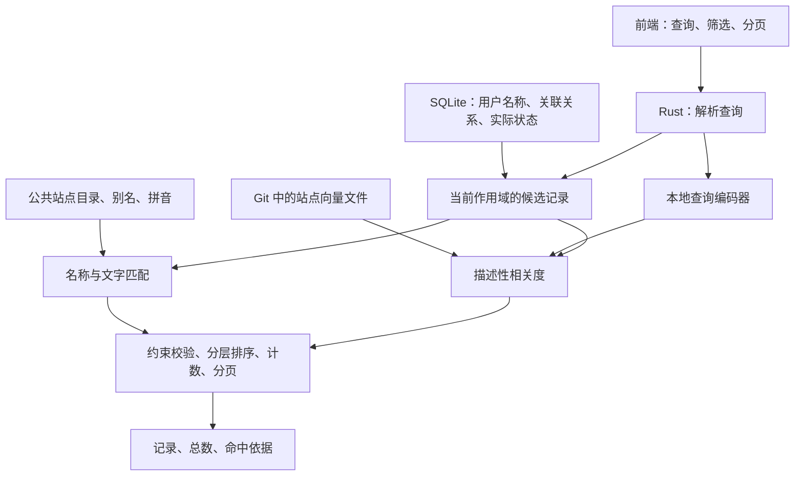

**服务端本地智能搜索实施方案**

设计日期：2026-09-06。实施状态：服务端、前端与离线资产已落地，正在按本方案核对发布门槛；实际结果见[实施计划](server-smart-search-plan.md)和[验收报告](server-smart-search-validation.md)。下文保留设计阶段的目标和依据，不能将目标数字视为实测成绩。适用范围：站点、签到任务、刷流任务，以及签到执行记录的同类搜索。

**1. 最终架构与交付边界**

采用 Rust 进程内混合搜索：用户配置和实时状态来自 SQLite，公共知识来自站点目录，名称搜索使用确定性匹配，描述性搜索使用本地模型向量。前端只提交查询、筛选和分页参数，展示服务端结果。

完整交付包含名称、别名、域名、拼音、首字母、多关键词组合、中英文概念映射、受控拼写容错、向量语义检索、相关度排序、服务端分页。站点名称、任务名称由用户自由填写。用户修改后，新名称和关联搜索在保存成功后的查询中生效。

公共元数据、固定版本的模型资产、查询词表及预生成向量纳入本项目 Git。安装后离线工作，查询在运行 kirara 的设备上处理。普通构建使用仓库内的资产，不要求旁边存在 pt-sites，也不在构建脚本或首次启动时临时下载模型。

本轮语义检索对象为站点的公开资源方向、特色等描述。任务继承所关联站点的公开语义信息；任务名、标签、执行结果和错误消息通过文字与结构化字段搜索。刷流任务内部的种子搜索继续使用独立查询，不与任务管理搜索混为同一个索引。



**2. 已核实的项目事实**

现有技术栈是 Rust、Axum、SQLite，前端为 React，桌面版共用 Rust 服务。站点与签到页面目前在浏览器中做包含匹配；刷流任务列表缺少搜索，任务内部种子已有服务端分页。旧列表接口还被表单选项和其他功能使用，应通过新增接口接入搜索。

当前 pt-sites 源版本为 `dcd825aa1684680a52e6a85b42fb410b5551e156`，包含 308 个站点。抽取 ID、名称、别名、URL、资源分类、内容类型、特色、集合标签、发布组后的紧凑 JSON 为 91,966 字节，gzip 约 15 KiB；该数字尚未包含完整描述、拼音、域名映射或模型。

现有完整索引为 1,488,828 字节。其 308 × 2 × 384 维 float32 向量部分为 946,176 字节，约 924 KiB；其余部分包括元数据和索引头。索引文件本身不是主要的潜在体积负担，查询编码器及其依赖才需要重点控制。

本地安装的 `@ternlight/mini@0.1.1` WASM 为 7,575,678 字节，gzip 为 5,041,669 字节。这是现有 WASM 的实测大小，不能当作 Rust 原生集成后的安装包增量。

`pt-sites` 的目录 ID 与 kirara 现有 PTD ID 并不一致，例如前者是 `m-team`，后者是 `mteam`。匹配时必须显式转换，不能靠去连字符、模糊名称等通用规则猜测。

**3. 将用户配置身份、目录身份和名称分开**

| 数据 | 示例 | 职责 |
|---|---|---|
| 本地站点 ID | `sites.id = 42` | 用户配置的主键，任务继续通过它关联 |
| 自定义名称 | `主力刷流站` | 用户展示名，文字搜索最高优先级 |
| 公共目录 ID | `qingwa` | 取得官方名称、别名、分类和向量 |
| PTD ID | 按显式映射确定 | 与已有目录衔接，保留自己的命名空间 |
| 关联方式 | `auto / manual / none` | 自动识别、手动指定、明确不关联 |

建议新增 `site_search_bindings` 表，字段为 `site_id`、`mode`、`catalog_id`、`matched_host`、`catalog_revision`。`site_id` 是本地站点外键；公共目录不必复制成一整套可编辑数据库表。初始化为自动模式，匹配不到时允许 `catalog_id` 为空。

解析关联的优先顺序：手动指定；用户明确不关联；自动模式下按已验证域名映射。域名使用 URL 解析器取得 hostname，再做大小写、IDNA 和末尾点规范化。`www`、旧域名、镜像、API 域名只在明确的别名表中互通，不采用任意后缀匹配。共享反代主机或匹配冲突不自动绑定。

已有 PTD 域名表通过显式 `ptd_id -> catalog_id` 映射复用；官方 URL 提供另一项已知域名证据。名称仅用于向用户推荐手动关联候选，不能决定自动绑定。`site_type` 是协议类型，也不能单独作为公共目录身份。

自动模式下修改地址会重新识别，并清除失效的旧关联；改名不影响关联。手动模式下修改地址保留用户选择，界面继续显示关联的目录站点。切到 `none` 后，更新目录或重启也不能重新自动关联。

多个本地站点可以关联同一公共目录：例如同一站点的两个账号。搜索返回两条本地记录，各自应用其任务和状态，不能按目录 ID 去重。不同站点使用相同自定义名称时同样保留各自记录，以现有地址或配置 ID 区分。

公共目录更新时，自动关联重新校验；手动关联绝不改绑到另一个 ID。被移除或无法解析的目录 ID 保留为待处理关联，自定义名称、域名等搜索继续工作。

这个关联只提供搜索知识，不改变实际站点地址、认证、协议适配器或任务执行行为。

**4. 搜索文档分为公共资料和本地资料**

公共资料按目录 ID 保存：名称、官方别名、已验证域名、PTD ID 映射、资源分类、特色、发布组、集合标签，以及经过筛选的短描述。出处和核查日期用于数据维护；开放注册等易变信息只能代表目录快照，不宣称为实时状态。

本地站点资料包含自定义名称、实际 hostname、现有类型、已有可搜索用户名和 UID。任务资料包含任务名、任务 ID、显式标签、关联站点 ID、启用状态和最近执行结果；保留原本支持的消息搜索。

索引不直接序列化完整配置对象。Cookie、Passkey、API Key、请求头和带查询参数的 RSS URL 不进入搜索资产或新返回字段。RSS 来源最多使用解析后的 hostname 作为辅助文字，不从 RSS 地址猜测账号关联。搜索响应复用现有安全 DTO，凭据暴露规则与现有接口一致。

目录未收录的站点仍支持自定义名称、拼音、域名、任务名和状态。没有公开资料时，不推断它具备哪些资源或用户等级门槛。自定义名为“动漫备用站”可因名称匹配“动漫”，但不能据此生成“官方动漫站”的结论。

签到、刷流任务通过本地站点 ID 继承两套名称。没有关联站点的刷流任务仍通过自身字段匹配。执行记录保留历史站点名称的搜索，同时可以匹配仍存在的当前关联；站点或任务删除后不按相似名称重新接到另一个实体。

**5. 名称、拼音与文字搜索规则**

搜索专用规范化采用 NFKC、Unicode case folding 和空白折叠；原始显示名不变。保留原始分词表示与紧凑表示，让 `M-Team`、`M Team`、`mteam` 在文字搜索中互通。这种宽松处理不参与身份自动关联。复用项目现有 Unicode 依赖。

官方名称与别名的拼音在生成公共资产时预计算。自定义站名、任务名在保存或读取新版本文档时由服务端生成并缓存，避免仅预生成官方站点导致自定义名不支持拼音。

拼音候选实现为 Rust `pinyin` 的最小无声调功能，加一份小型站名与常见多音词纠正表；不启用不需要的声调输出。公开库提供可独立选择的 `plain` 等 feature，最终字表和代码增量必须实测。[rust-pinyin 配置](https://github.com/mozillazg/rust-pinyin/blob/master/Cargo.toml)

支持无声调全拼、连续首字母及中英文数字混排。对 `ü / v / u:` 设定统一搜索表示。短首字母需要完整匹配；单字母不做首字母模糊扩展。多音字用固定纠正表与测试控制，不承诺任意中文姓名读音都正确，也不展开所有读音的笛卡尔积。

容错仅针对足够长的拉丁字母词和全拼：4–7 个字符最多一次插入、删除、替换或相邻换位；更长词是否开放两次错误由负样例验收决定，默认仍为一次。数字 ID、域名身份、状态值、短缩写、中文短名和首字母不使用错拼容错。

字面词默认跨字段 AND：例如“青蛙 备用”要求两个有效词都能在该条记录自身或关联站点资料中得到解释。别名与概念扩展只扩展对应词，不能把 AND 放宽成任意命中一个词。引号内短语按连续文字匹配，不做自动状态识别和错拼扩展。

**6. 查询解析与状态语义**

解析结果统一为 `QueryPlan`：显式筛选、明确实体线索、字面词、描述性片段和需要展示的解释。完整自定义名称或官方别名命中优先识别；再进行保守的最长词匹配，避免把名称中的普通词误当筛选条件。

| 输入 | 解释 |
|---|---|
| `主力刷流站` | 自定义名称匹配 |
| `青蛙`、`QingWa`、`qingwa` | 名称、官方别名或拼音匹配 |
| `青蛙 失败` | 关联青蛙，并满足本作用域的失败条件 |
| `青蛙 已暂停` | 关联青蛙，并满足任务未启用条件 |
| `动漫 anime` | 同一概念的两个表达，去重后匹配 |
| `适合新手的动漫站` | 描述性查询，概念映射和向量共同参与 |
| `name:"失败收藏站"` | 字面名称，不推导失败状态 |
| `result:failed enabled:true` | 最近执行失败，同时任务仍已启用 |

结构化筛选与语义偏好必须分开。状态、指定站点、指定 ID、协议类型、显式集合标签是硬条件，向量分数无法补偿不满足条件的记录。“适合新手”等描述是软偏好，不能冒充权威分类。

站点的“失败”依据采集错误，“正常/待采集”沿用现有健康判定。签到任务的结果依据 `last_status`，执行记录依据该次 `status`，刷流任务的结果依据解析后的 `last_run_info.status`。JSON 缺失、损坏或从未执行应为未知，不当作成功。

任务“已启用/已停用”使用 `enabled`。已启用不等于当前正在执行；第一版不把这两个概念互换。任务列表的失败表示最近结果失败；“以前失败过”须在执行记录作用域查询，不能扫一段历史消息便判定当前失败。

只有明确、独立且无歧义的自然语言状态词才转为硬条件，并在界面显示已识别的筛选，可取消。完整输入恰好等于用户自定义名称时，优先按名称处理；需要状态时使用筛选控件或显式字段。文字推导条件与控件条件冲突时返回空集并解释，不默默覆盖用户条件。

显式语法仅支持少量受控字段：`name:`、`site:`、`id:`、`enabled:`、`result:`，站点作用域另外支持 `health:`、`type:`。不支持的显式字段返回明确的参数错误。第一版不解析任意自然语言布尔逻辑；尤其不能把“未失败”“不要失败”误拆成正向“失败”。无把握的表达保留为文字，提示可用筛选方式。

**7. 向量方案的明确选择与验证门槛**

首选：将固定版本 ternlight mini 推理核心以 Rust 原生模块集成到 kirara，使用同一版本的模型权重和 tokenizer。服务端进程内推理，普通名称搜索可以直接走文字路径。模型在首次描述性查询时加载一次，共享只读权重。

适配层仅保留原生计算与必要的 tokenizer 能力，浏览器绑定不进入运行路径。空查询、纯 ID、明确名称、短缩写和纯状态查询不启动模型；空查询沿用各列表现有默认排序。描述性片段才触发向量编码，避免每次输入字符都付出模型推理成本。

上游确有 Rust 推理实现，数值内核包含非 WASM 的标量分支；但该分支不是上游主要发布路径。因此“存在原生代码”只能证明有适配基础，不能证明原生性能和本项目四类目标平台已经合格。[上游数值内核](https://github.com/soycaporal/ternlight/blob/main/engine/src/kernels.rs)

适配的第一项工作是取得来源明确、可再分发且与选定版本对应的原始权重。上游源码通过 `assets/model.bin` 嵌入权重，该文件不是源码仓库内现成提交的资产；不能仅复制源码就承诺能构建。[上游模型装载](https://github.com/soycaporal/ternlight/blob/main/engine/src/model.rs)

现有编码器使用 BERT-base-uncased tokenizer，因此不能据其英文演示推断中文原生语义质量。中文检索以已存在的中英文概念映射辅助，查询与目录描述使用同一份扩展规则。实际中文效果必须在本领域查询集上与现有 pt-sites 混合搜索、纯文字/概念基线比较。[上游 tokenizer](https://github.com/soycaporal/ternlight/blob/main/engine/src/tokenizer.rs)

保留原中文片段，同时在 token 预算内加入已识别的英文概念；先放最相关信息，避免重要内容在截断后消失。官方别名和名称不依赖模型理解。对于映射词表之外的中文同义表达，是否可召回以测评为准，不承诺通用中文问答能力。

原生集成验证必须覆盖：实际权重与词表的 SHA256；与选定参考实现的 tokenizer 和向量输出一致性；Linux x86_64 musl、Linux ARM64 musl、Windows x86_64、macOS ARM64 的构建与运行；中文质量；冷启动、热查询、内存与发行包增量。

重生成索引是正式交付步骤。使用最终的 Rust 编码器、确定的描述模板和规范化规则，生成本项目自己的目录向量。更换 tokenizer、权重、池化、概念扩展或描述模板中的任何一项，均更新兼容性指纹并重建相关向量。向量相同维数不代表可以混用。

第一版不自训或蒸馏模型。若 mini 原生适配未通过门槛，先提交失败数据和候选替代编码器的同口径比较，再确定替换；不能静默取消语义检索，也不能把规则向量、哈希向量改称为等价的模型语义功能。需要更大模型或额外安装包属于方案变更，应明确说明对原约束的影响。

**8. 索引内容与排序**

每个目录站点预生成两个短文档向量：资源方向；特色与已有入门描述。名称、别名、发布组仍保留独立的文字字段。两个短文档避免把全部资料拼成长段后截断，也便于区分资源主题和描述偏好。

第一版存储归一化 float32、明确小端序，308 站点的两个向量约 924 KiB。采用全量点积计算；这个规模无需独立向量数据库或近似最近邻索引。只有全包预算实测确有需要，才评估 int8 输出向量量化；它最多节省约 693 KiB 原始向量数据，不能解决模型及依赖占用。

搜索候选来自当前作用域的本地记录。先按硬条件缩小范围，再取得这些记录关联的目录向量，计算文字和描述性相关度。不得先从公共目录截取全局 Top-K 再与用户站点求交集，否则可能遗漏用户实际拥有的匹配站点。

最终以本地记录 ID 返回结果。任务关联的站点向量只负责站点描述，不能为任务的运行状态提供证据。别名与名称分数、任务文字分数、语义分数分别计算。

排序先判断条件是否满足，再采用固定层级：完整自定义名称/任务名；完整官方名称或别名；前缀与完整拼音；包含与多词文字命中；首字母和受控容错；仅语义相关。层内按覆盖度、字段权重、相似度排序，最后用稳定的本地 ID 打破平局。纯描述性查询按概念证据和语义相关度排序。

不对未经校准的原始文字分数、余弦相似度直接求和。精确命中不能被泛语义结果挤走；明确站点线索不允许向量跨到另一站点补足。纯语义结果使用在负样例上校准的绝对门槛，不按本次最好结果相对归一化，也不强行凑满一页。

关键词组合仍遵守有意义词项的覆盖约束。自然语言描述作为独立片段编码，不机械要求每个语气词都出现；它与已解析的实体、状态条件共同成立。无法满足的字面条件不能被描述性片段的高相似度忽略。

**9. Git 资产、生成工具与升级**

建议目录结构如下，名称是待实现的约定：

```text
assets/search/
  catalog.json             公开目录快照、别名、域名和预生成拼音
  concepts.json            查询与目录共用的概念映射
  ptd-crosswalk.json       PTD 与公共目录的显式 ID 映射
  overrides.json          有出处的域名/别名/读音修正
  catalog-vectors.bin     Rust 生成的静态站点向量
  manifest.json           格式、模型、处理流程、数据摘要
  models/mini/            固定模型、tokenizer、许可与来源
xtask/                    导入、构建、校验、测评工具
src/search/               身份解析、查询、文字匹配、推理、排序
tests/fixtures/search/    功能、相关度与兼容性样例
```

`catalog.json` 是带原始必要描述的可审阅数据快照，足以脱离 pt-sites 重建向量。导入器只读取 `pt-sites/data/sites/*.json`，绝不在源仓库生成或手改聚合数据。只导入字段白名单；目录源 ID 稳定保留，另存映射，不重写源 ID。

拟提供 `cargo xtask search import --source ../pt-sites`、`build`、`verify`、`eval` 四类命令。导入是维护者的显式操作；一般用户和 CI 构建消费已经提交的快照与向量。

清单至少记录格式版本、目录源提交、导出数据哈希、按 ID 排序的行映射、模型/词表哈希、引擎修订、维数、归一化方法、字节序、文档模板版本、概念映射版本及向量文件哈希。解码时校验所有长度、行数、有限数值和归一化范围，不能把文件字节任意强转为未经验证的浮点切片。

指定固定生成环境产生规范资产，稳定字段/行顺序，不写入影响输出的当前时间戳。CI 校验提交资产的哈希与输入一致性；规范环境可做逐字节重建校验。其他 CPU 平台验证向量数值容差和排名，不要求所有浮点计算逐字节相同。

公共词表、原始模型和向量普通 Git 跟踪，按发布版本更新，避免每次运行产生提交。私有站名、用户名、任务、错误消息和查询缓存不进入这些文件。模型来源与许可随资产一起保存。

升级时一起发布模型、词表、元数据、索引和清单；启动校验不通过时停用语义通道，继续可用的文字搜索并返回可见的降级标记。不能混用新模型与旧向量。只回退二进制即可恢复其中自带的上一套公共资产；本地数据库迁移采用增量方式，不依赖向量生成成功才能读取原业务数据。

**10. 服务端状态、缓存和并发**

SQLite 是本地名称、任务关系与状态的唯一来源。每次搜索在短读事务内读取需要的轻量资料与状态快照，释放数据库连接后再运行匹配和模型推理。这样不需要让每个后台状态写入点维护第二份事实库。

静态目录和预计算文字字段在进程内共享。自定义名称的规范化与拼音按 `(实体类型, 本地 ID, 内容摘要, 处理版本)` 缓存；查询读取到新内容即构建新条目，避免只靠 HTTP 更新事件而漏掉导入、恢复或后台修改。删除记录从数据库候选中消失，即使旧缓存尚未清理也不能再返回。

第一版不缓存完整搜索结果和动态状态。可以缓存查询向量，键包含规范化后的语义片段、模型指纹和概念规则版本；设置小容量 LRU 与过期时间，仅保存在内存。文件和日志不默认记录原始查询或私有匹配文本。

CPU 推理使用有界工作队列和独立阻塞工作线程，默认 1 个推理工作者，测评后再调整。共享模型权重，按工作者分配临时缓冲，不按每条任务加载模型。不允许键入请求无限堆积，查询长度和返回数量设上限。

超时、模型初始化失败或队列饱和时，在同一响应中返回已完成的文字结果与 `semantic_status`。第一版不在响应完成后再追加语义结果改变当前页。降级是运行故障处理；正常发布的功能验收仍必须通过完整混合模式。

**11. 接口与分页契约**

新增下列 GET 接口，已有数组列表接口继续服务现有调用方：

```text
/api/sites/search
/api/sign-in-tasks/search
/api/brush-tasks/search
/api/sign-in-records/search
/api/site-catalog/search     仅供手动关联目录时选择
```

管理页三个主接口只返回用户本地配置。公共目录结果只出现在独立的目录选择接口中。

公共参数为 `q`、`page`、`page_size`；作用域参数使用各自的实际含义：站点 `health/type`，任务 `site_id/enabled/result`，签到记录 `task_id/site_id/result`。默认每页 20 条，上限 100；限制查询长度，例如 256 个 Unicode 标量。非法页码或字段值返回参数错误。

响应示例，数值仅用于说明结构：

```json
{
  "items": [{ "record": { "id": 42, "name": "主力刷流站" }, "matched_by": ["catalog_alias"] }],
  "total": 7,
  "page": 1,
  "page_size": 20,
  "parsed_filters": [],
  "semantic_status": "used"
}
```

`record` 使用作用域现有 DTO 的字段约定；`matched_by` 只表示名称、别名、拼音、概念、容错或语义相关。只有真实命中的词或目录事实可以作为解释；单纯向量命中显示“语义相关”，不伪造具体命中理由，不把相似度显示成正确概率。

同一请求先完成所有硬条件过滤、相关度门槛和排序，再计数和截页。`total` 是全部匹配本地记录数，不是公共目录数或 Top-K 个数。没有结果返回空数组和零总数。

分页在相同数据下顺序稳定。不同请求之间数据可能变化，页码超过当前末页时返回合法的实际页码，前端同步；不承诺跨请求快照永久固定。改查询与筛选回到第一页。

签到记录不能先调用现有最多 500 条的列表方法再搜索；新接口必须搜索满足作用域限制的全部已保存记录。历史日志量较大时将结构化筛选下推 SQL，在同一读快照中按批匹配并精确计数；第一版不把全历史日志向量化。

**12. 前端接入与自定义站点体验**

站点编辑中增加可选的“关联目录站点”，默认自动识别，提供手动选择和不关联。该控件显示识别结果；不覆盖用户已经输入的名称。新建时若名称为空，可以沿用已有的名称建议行为。

三个管理页共享服务端搜索请求逻辑，输入约 200–250 ms 防抖。中文 IME 组合输入结束后发查询。用请求序号丢弃过期响应；浏览器支持时同时取消旧请求，桌面传输不能取消时仍必须保证旧响应不覆盖新结果。

前端不下载公共向量、模型或搜索词表，也不重新根据 `includes`、拼音或模型分数过滤返回结果。列表中的分页、总数和空状态来自搜索接口。

区分加载中、没有匹配、查询失败和语义降级。查询失败提供重试，不能显示成“暂无站点”。更新期间不允许把旧查询的条目当作新结果进行批量操作。搜索框和分页有可访问名称，状态提示使用适当的 live region。

站点和任务保存、启停、执行、删除后刷新当前查询；保留搜索词和仍适用的筛选，必要时校正页码。已有全量列表可继续供配置表单使用，但不能拿它替代搜索结果做浏览器过滤。

**13. 体积与性能预算**

用户尚未给出具体字节上限，以下先作为工程目标，用于阻止选型无边界膨胀；不是已经测得的成绩，也不是获得授权后可以无限放宽的指标。

| 项目 | 初始目标与测量方式 |
|---|---|
| 压缩发行包新增 | 目标不超过 8 MiB，各平台与同配置基线比较 |
| 解包后二进制及资源新增 | 目标不超过 12 MiB，与压缩值分别报告 |
| 新增模型推理进程 | 0，共用 Rust 服务进程 |
| 前端搜索引擎/模型资产 | 0；另报普通交互代码的实际增量 |
| 公共 float32 向量 | 当前规模约 924 KiB，元数据等另外计入 |
| 搜索额外常驻/峰值内存 | 目标 64 MiB 内，冷加载与并发分别测量 |
| 文字热查询 | 目标 p95 ≤ 50 ms，服务端耗时 |
| 混合热查询 | 目标 p95 ≤ 200 ms，含排队与推理 |

性能用固定数据集测量：1,000 条本地站点配置、10,000 条任务，包含同站点多账号、重复名和未收录站点；分别记录单请求与 4 个并发请求。先使用资源受限的 2 核 CPU、无 GPU 环境，报告确切硬件、构建参数和冷查询时间；ARM64 另报结果，不套用上游 M 系列 WASM 的演示速度。

总增量必须包括模型、词表、拼音、tokenizer、原生推理代码及间接依赖，不能只报告向量大小。Git 下载体积、发行包大小、解包大小、首次运行新增文件和 RAM 分开记录。改变全局编译优化时必须重建同参数基线，避免用无关优化掩盖搜索增量。

同时报告相对原发行包的增长百分比。8 MiB 是首轮选型预算，并不代表用户已经接受这一增量；若基线包本身较小，即使绝对值达标也必须呈现相对增长，不能直接宣称已经满足“小体积”要求。

首次试验若超过预算，先定位实际大项；不能用首次启动下载、另起 Node 服务等方式把体积移到统计之外。若完整语义能力与预算确实冲突，应给出具体差额和可选取舍，再调整范围。

**14. 验收样例与发布门槛**

| 场景 | 必须得到的行为 |
|---|---|
| 青蛙改名为“主力刷流站” | 新名称、青蛙、QingWa、全拼均找到该本地配置 |
| 自定义“备用小站”，无目录关联 | 原名、全拼、首字母仍可搜索 |
| 名称含“失败”，任务实际成功 | 完整名称能搜到；显式失败筛选不能搜到 |
| 同目录两个账号，一成一败 | 名称搜出两个账号，失败条件仅保留实际失败者 |
| 不同目录同名配置 | 分别返回，不按名称合并 |
| 站点任务改名或改绑定 | 保存后的下一次搜索使用新信息 |
| 反代地址无法识别 | 保持未关联；手动选择后获得官方别名和描述能力 |
| 手动关闭自动关联 | 重启、更新目录后不自行恢复 |
| `m-team` 与 `mteam` | 显式映射命中；其他相似 ID 不被误合并 |
| `qingwa.example.invalid` | 不因包含已知名称自动识别为青蛙 |
| 青蛙 + 失败/停用 | 所有返回结果同时满足站点与状态条件 |
| 长英文一处错拼 | 正确候选可召回，排在精确结果之后 |
| 一字母/短缩写 | 不触发大量容错或模糊拼音结果 |
| 多音字、中英混排、全角输入 | 按固定样例得到一致的规范化和拼音匹配 |
| “无损音乐”“适合新手的动漫站” | 通过标注集检验语义相关性，结果只包含已配置实体 |
| 显式状态与文字状态冲突 | 空集并解释，不能放宽条件 |
| 无关随机字符串 | 返回空集，不强制提供语义近邻 |
| 第 21 条及更后面的任务匹配 | 从第一页可以搜到，total 正确 |
| 超过旧日志读取上限的记录 | 新搜索接口仍可找到 |
| 删除、导入、恢复数据库配置 | 不依赖某个前端保存事件才更新搜索 |
| 快速连续输入与中文输入法 | 最后一次完整输入对应最终结果 |
| 模型坏文件或版本不一致 | 明确降级，普通搜索可用，无错误向量混用 |
| 同输入、同快照重复查询 | 顺序和总数相同 |

建立至少 100 条固定功能/相关度用例，覆盖中文、英文、拼音、错拼、歧义、否定与无结果；留出独立样例验证阈值，不能用全部验收数据反复调参。参考 pt-sites 现有验证样例，但增加自定义名称、账号关系、跨页、误召回等本项目场景。

确定性功能必须全部通过，硬条件误返回必须为零。语义部分分别比较纯文字/概念、现有 pt-sites 混合策略和新 Rust 混合策略；在具有相关度标注的同一测试集上报告 NDCG@10、Precision@5、无结果误召回，以及中文困难样例的实际前五条。

发布要求：中文语义效果不劣于现有基线，且在描述性查询上相对文字/概念基线有可观察增益；精确名称和状态查询不能回退。若只是更复杂、没有增益，不能宣布向量功能验收完成。若启用 int8 存储，另外证明相对 float32 的 NDCG@10 下降不超过 1%。

只做与本功能相关的校验：Rust 搜索与接口测试、资产校验、四平台构建/运行检查、前端构建及关键交互验证、同配置体积与性能对比。现有站点编辑、任务启停和桌面 API 传输需要回归验证。

**15. 实施顺序与可审阅交付物**

第一步，做原生编码器可行性验证。交付固定权重/词表来源与哈希、可运行的原生样例、参考输出一致性、中文结果、四平台可用性和大小/内存/耗时报告。这一步决定首选模型能否满足完整方案；不先把接口和 UI 做完后才发现模型无法发布。

第二步，落实身份模型和资产链。交付关联表迁移、域名与 ID 映射、手动关联接口、生成工具、可审阅目录快照、Rust 生成的向量文件及清单；验证改名、多账号、反代、未收录站点和版本迁移。

第三步，实现统一搜索服务和四个业务接口。交付查询解析、动态字段匹配、最小拼音能力、受控容错、向量排序、错误降级和搜索后分页；用固定数据验证跨字段、跨页和状态正确性。

第四步，接入三个页面和签到记录。交付搜索框、筛选解释、分页、目录关联、加载/空/错误状态及响应竞态处理，沿用现有视觉风格。

第五步，完成验收报告。交付真实查询样例、同配置体积差异、性能与内存数据、相关度指标、已知能力边界和资产更新说明。只有正常混合搜索、确定性功能、平台和预算门槛都通过，才标记完整实现完成。

实施代码、数据库迁移、依赖、目录、模型及 Rust 生成的向量现已加入工作区。用户已授权提交、推送当前实现；未操作真实用户数据库。发布门槛的已通过项与未通过项以验收报告为准。
